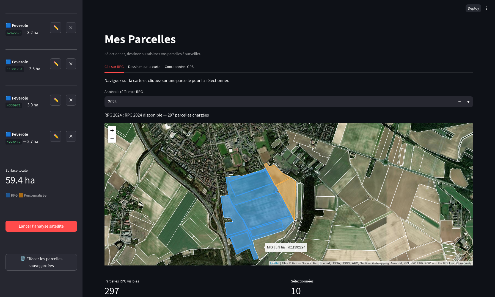
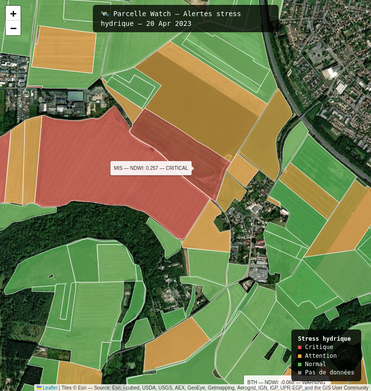
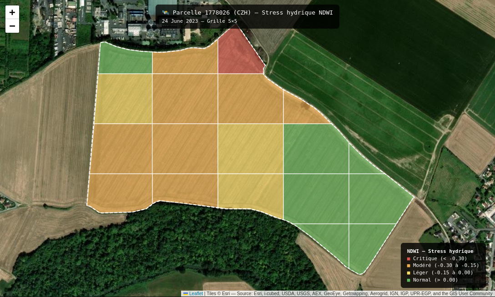
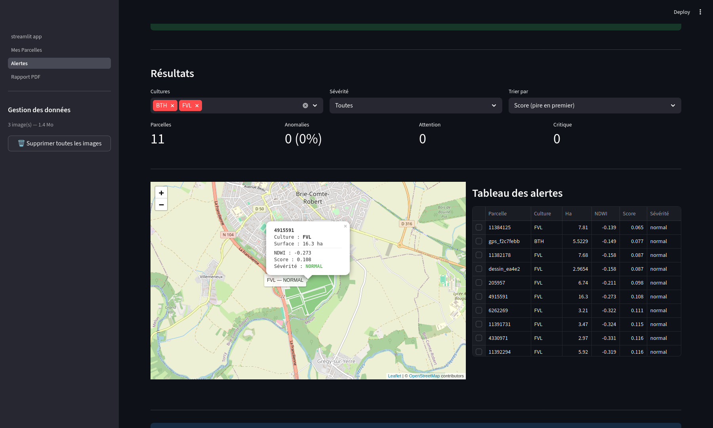

# 🛰️ Parcelle Watch

> **Surveillance satellite open source des parcelles agricoles — détection et localisation des stress végétatifs.**

Parcelle Watch est un outil open source qui combine **imagerie satellite, données météorologiques et apprentissage automatique** pour détecter des anomalies au sein de parcelles agricoles et localiser les zones potentiellement concernées.

Le projet est conçu comme un outil **local et sans abonnement**, avec une interface Streamlit permettant de sélectionner ses parcelles, lancer une analyse à partir d'une image Sentinel-2 récente et visualiser les alertes directement sur une carte.

**Statut : MVP fonctionnel — validation et extension des modèles en cours.**

---

## 🎯 Objectif

L'objectif de Parcelle Watch est de transformer des données satellitaires et météorologiques en informations directement exploitables à l'échelle de la parcelle.

Le pipeline permet notamment de :

* récupérer automatiquement des images **Sentinel-2** ;
* calculer plusieurs indices de végétation au niveau du pixel ;
* croiser ces informations avec les contours du **Registre Parcellaire Graphique (RPG)** ;
* enrichir les observations avec des données météorologiques historiques ;
* détecter des anomalies de végétation avec des modèles d'**Isolation Forest** ;
* localiser les anomalies à l'intérieur d'une parcelle ;
* visualiser les résultats sur une carte interactive ;
* générer un rapport PDF.

L'approche est volontairement orientée vers la **localisation des zones nécessitant une attention particulière**, plutôt que vers une simple classification globale de la parcelle.

---

## 🌱 Fonctionnalités

### Sélection des parcelles

Les parcelles peuvent être sélectionnées de trois façons :

1. **clic sur une parcelle du RPG** ;
2. **dessin libre d'une zone** ;
3. **saisie de coordonnées GPS**.

Plusieurs parcelles peuvent être conservées et analysées ensemble.

Le type de culture peut être modifié pour chaque parcelle afin de tenir compte des rotations culturales d'une année à l'autre.

---

### 🛰️ Données Sentinel-2

Parcelle Watch interroge le catalogue Copernicus pour rechercher les scènes disponibles sur la zone étudiée.

Le pipeline actuel récupère **7 bandes Sentinel-2** sous forme de GeoTIFF géoréférencés :

| Bande | Utilisation              |
| ----- | ------------------------ |
| B02   | Bleu                     |
| B03   | Vert                     |
| B04   | Rouge                    |
| B05   | Red Edge                 |
| B08   | Proche infrarouge        |
| B8A   | Proche infrarouge étroit |
| B11   | SWIR                     |

Les valeurs sont conservées en `FLOAT32` afin de travailler avec les valeurs de réflectance nécessaires au calcul des indices.

---

## 🌿 Indices de végétation

Les indices sont calculés au niveau du pixel :

* **NDVI** — vigueur générale de la végétation ;
* **NDWI** — indicateur lié à l'état hydrique ;
* **NDRE** — sensibilité à l'état azoté et à la chlorophylle ;
* **EVI** — indice de végétation complémentaire, notamment utile lorsque la végétation est dense.

Les statistiques de ces indices sont ensuite agrégées à l'échelle des parcelles ou des cellules intra-parcellaires.

---

## 🌦️ Données météorologiques

Les données historiques proviennent d'**Open-Meteo**.

Elles sont utilisées pour construire des variables agrégées adaptées aux différents modèles, notamment :

* précipitations sur 7, 14 et 30 jours ;
* température maximale et minimale ;
* déficit hydrique ;
* évapotranspiration de référence ;
* cumul de températures ;
* amplitude thermique ;
* proxy d'humidité ;
* évolution récente des précipitations.

Ces variables permettent de replacer les observations satellitaires dans leur contexte météorologique.

---

## 🤖 Détection des anomalies

Le modèle principal actuel repose sur **Isolation Forest**, une méthode d'apprentissage non supervisé adaptée à la détection d'observations atypiques.

### Stress hydrique

Le modèle hydrique combine notamment :

* NDWI ;
* NDVI ;
* évolution temporelle des indices ;
* déviation par rapport au comportement saisonnier ;
* précipitations ;
* température ;
* déficit hydrique.

Le modèle a été entraîné sur environ **350 000 observations**, couvrant :

* **8 zones géographiques françaises** ;
* **4 années (2021–2024)** ;
* plusieurs types de cultures.

Des modèles spécifiques sont disponibles pour différentes cultures :

`BTH`, `VRC`, `MIS`, `CZH`, `ORX` et `GENERAL`.

### Évaluation du modèle hydrique

Une évaluation dédiée a été mise en place à partir de cinq stratégies :

1. injection d'anomalies ;
2. cohérence temporelle ;
3. cohérence météorologique ;
4. cohérence spatiale ;
5. comparaison avec des observations de référence.

Le score obtenu sur ce protocole est de **78,6 / 100**.

Ce score correspond au protocole d'évaluation mis en place pour le modèle hydrique ; il ne constitue pas une précision générale du système ni une garantie de détection sur le terrain.

---

## 🧪 Modèles en cours de validation

Le dataset d'entraînement a été restructuré afin de pouvoir entraîner plusieurs modèles à partir d'un même ensemble de données satellitaires et météorologiques.

### Stress azoté

Le modèle s'appuie principalement sur :

* NDRE ;
* évolution du NDRE ;
* rapport NDRE/NDVI ;
* EVI ;
* NDVI ;
* précipitations et température.

L'objectif est notamment de détecter des situations où le NDRE diminue alors que le niveau général de végétation reste relativement élevé.

### Risque ravageurs

Le modèle utilise notamment :

* variabilité du NDRE ;
* variations brutales du NDVI ;
* rapport NDRE/NDVI ;
* évolution de l'EVI ;
* NDWI ;
* température minimale ;
* proxy d'humidité.

Ces deux modèles sont désormais intégrés à l'interface, mais leur **validation reste en cours**.

---

## 🗺️ Analyse intra-parcellaire

Une anomalie détectée à l'échelle d'une parcelle ne signifie pas nécessairement que toute la parcelle est concernée.

Parcelle Watch permet donc d'effectuer une analyse plus fine en découpant les parcelles en cellules de **100 × 100 m**.

Chaque cellule est analysée individuellement par le modèle.

La carte permet ensuite de visualiser :

* les zones normales ;
* les zones présentant un stress léger ;
* les zones en stress modéré ;
* les zones en stress critique.

Les cellules respectent la géométrie réelle de la parcelle au lieu de considérer une grille rectangulaire indépendante de celle-ci.

Cette approche permet également d'estimer, à titre expérimental, le potentiel d'économie d'eau associé à une irrigation ciblée.

> Exemple de cas testé : sur une parcelle de 78 ha, l'analyse identifiait 2,9 ha en stress critique, 35,4 ha en stress modéré et 15,5 ha en stress léger. La simulation associée estimait une réduction de 51 % du volume d'irrigation par rapport à une irrigation uniforme.
>
> **Il s'agit d'un cas de test sur une parcelle et une date données, et non d'une performance généralisable du système.**

---

## 🖥️ Interface

L'application est développée avec **Streamlit** et organisée en plusieurs pages.

Elle permet notamment de :

* sélectionner et conserver plusieurs parcelles ;
* modifier leur type de culture ;
* rechercher une image Sentinel-2 disponible ;
* récupérer les données météorologiques associées ;
* lancer l'inférence ;
* afficher les alertes sur une carte interactive ;
* filtrer les résultats ;
* sélectionner une parcelle pour afficher son analyse intra-parcellaire ;
* (en phase de développement) générer un rapport PDF.

Les parcelles sélectionnées peuvent être sauvegardées afin d'être retrouvées lors d'une session ultérieure.

---

## 📄 Rapports (en cours de développement)

Un rapport PDF peut être généré automatiquement à partir des résultats de l'analyse.

Les graphiques sont générés en mémoire avec Matplotlib et intégrés au document avec ReportLab.

---

## 🏗️ Architecture

```text
parcelle-watch/
│
├── app/
│   ├── streamlit_app.py
│   └── pages/
│       ├── 1_Mes_Parcelles.py
│       ├── 2_Alertes.py
│       └── 3_Rapport_PDF.py
│
├── src/
│   ├── ingestion/
│   │   ├── sentinel2.py
│   │   └── meteo.py
│   │
│   ├── indices/
│   │   └── vegetation.py
│   │
│   ├── models/
│   │   ├── anomaly_detection.py
│   │   └── yield_prediction.py
│   │
│   └── report/
│       └── pdf_report.py
│
├── data/
│   └── processed/
│       ├── models/
│       └── meteo/
│
├── docs/
├── tests/
│
├── pyproject.toml
├── .env.example
└── .gitignore
```

### Principaux modules

`src/ingestion/sentinel2.py`

* authentification Copernicus ;
* recherche des scènes disponibles ;
* téléchargement des images ;
* gestion des séries temporelles ;
* indexation des scènes.

`src/ingestion/meteo.py`

* récupération des données météorologiques historiques ;
* préparation des variables utilisées par les modèles.

`src/indices/vegetation.py`

* chargement des bandes ;
* calcul de NDVI, NDWI, NDRE et EVI.

`src/models/anomaly_detection.py`

* chargement des modèles ;
* préparation des features ;
* détection des anomalies ;
* gestion des modèles par culture et type de stress.

`src/models/yield_prediction.py`

* infrastructure prévue pour la prédiction du rendement avec XGBoost. (travaux en cours)

`src/report/pdf_report.py`

* génération des rapports PDF. (en cours de développement)

---

## 🗃️ Données d'entraînement

Le dataset multi-modèles a été construit à partir de plusieurs zones agricoles françaises et de données couvrant **2021 à 2024**.

Les principales zones utilisées sont :

* Brie ;
* Beauce / Châteaudun ;
* Pithiviers ;
* Champagne / Reims ;
* Épernay ;
* Amiens ;
* Loudéac ;
* Pauillac.

Les données sont organisées autour de cellules de **100 × 100 m**, afin d'harmoniser les observations utilisées pour l'entraînement.

Le pipeline produit notamment :

```text
data/processed/
├── meteo_par_zone.parquet
├── cells_indices.parquet
└── training_dataset.parquet
```

Les modèles entraînés sont sauvegardés au format `joblib`.

---

## 🔧 Stack technique

| Domaine               | Technologies                          |
| --------------------- | ------------------------------------- |
| Langage               | Python 3.11                           |
| Gestion environnement | Poetry                                |
| Imagerie satellite    | Sentinel-2, Sentinel Hub / Copernicus |
| Raster / géospatial   | rasterio, GeoPandas, Shapely          |
| Données agricoles     | RPG / IGN                             |
| Données météo         | Open-Meteo                            |
| Calcul scientifique   | NumPy, Pandas                         |
| Machine Learning      | scikit-learn, Isolation Forest        |
| Modèle de rendement   | XGBoost                               |
| Interface             | Streamlit                             |
| Cartographie          | Folium                                |
| Visualisation         | Matplotlib                            |
| Rapports              | ReportLab                             |
| Modèles sauvegardés   | Joblib                                |

---

## 🌍 Sources de données

| Source                      | Données utilisées                                                   |
| --------------------------- | ------------------------------------------------------------------- |
| **Copernicus / Sentinel-2** | Imagerie multispectrale                                             |
| **IGN / RPG**               | Géométrie et informations des parcelles agricoles                   |
| **Open-Meteo**              | Données météorologiques historiques                                 |
| **Agreste**                 | Données historiques de rendement, destinées au modèle de prédiction |

---

## 🚀 Installation

### 1. Cloner le dépôt

```bash
git clone https://github.com/TON_PSEUDO/parcelle-watch.git
cd parcelle-watch
```

### 2. Installer les dépendances

```bash
poetry install
```

### 3. Configurer Copernicus

Créer le fichier `.env` à partir du modèle fourni :

```bash
cp .env.example .env
```

Puis renseigner les identifiants nécessaires à l'accès à l'API Copernicus.

### 4. Lancer l'application

```bash
poetry run streamlit run app/streamlit_app.py
```

---

## ⚠️ Limites actuelles

Parcelle Watch est un **prototype de recherche et de démonstration**, et non un outil agronomique certifié.

Plusieurs limites restent à prendre en compte :

* les modèles de stress reposent principalement sur de la **détection d'anomalies non supervisée** ;
* la validation avec des observations terrain réelles reste limitée ;
* la qualité et la disponibilité des images Sentinel-2 dépendent notamment de la couverture nuageuse ;
* les premières analyses d'une parcelle ne disposent pas nécessairement d'un historique local suffisant pour calculer certaines variables temporelles ;
* les modèles azote et ravageurs nécessitent encore une validation dédiée ;
* la prédiction de rendement n'est pas encore intégrée au parcours fonctionnel principal ;
* les estimations d'économie d'eau sont des simulations sur des cas testés et ne constituent pas une recommandation d'irrigation.

---

## 🛣️ Roadmap

### Court terme

* [x] Pipeline complet Sentinel-2
* [x] Calcul NDVI / NDWI / NDRE / EVI
* [x] Intégration RPG
* [x] Enrichissement météorologique
* [x] Modèle de détection du stress hydrique
* [x] Évaluation du modèle hydrique
* [x] Analyse intra-parcellaire
* [x] Interface Streamlit
* [x] Intégration des modèles azote et ravageurs dans l'interface
* [ ] Génération de rapports PDF
* [ ] Validation des modèles azote et ravageurs
* [ ] Gestion d'erreurs plus explicite pour les accès aux API

### Ensuite

* [ ] Intégration des données Agreste
* [ ] Modèle de prédiction du rendement
* [ ] Validation sur des données externes / terrain
* [ ] Amélioration de la visualisation de l'imagerie Sentinel-2 récente
* [ ] Tests et documentation technique complémentaires

---

## 📸 Démonstration

### Sélection des parcelles



### Analyse des alertes



### Analyse intra-parcellaire



### Tableau des résultats



---

## 🧑‍💻 À propos du projet

Parcelle Watch est un projet portfolio consacré à l'application de la **Data Science et de la Data Engineering à l'agriculture de précision**.

Il explore notamment :

* l'ingestion de données géospatiales ;
* le traitement d'imagerie satellite ;
* le feature engineering temporel et météorologique ;
* la détection d'anomalies ;
* le traitement de données raster et vectorielles ;
* le déploiement d'un pipeline de bout en bout dans une application interactive.

Le projet est développé avec une approche **open source, locale et reproductible**, avec l'objectif de transformer des données complexes en informations compréhensibles à l'échelle d'une parcelle.

---

## 📄 Licence

MIT

